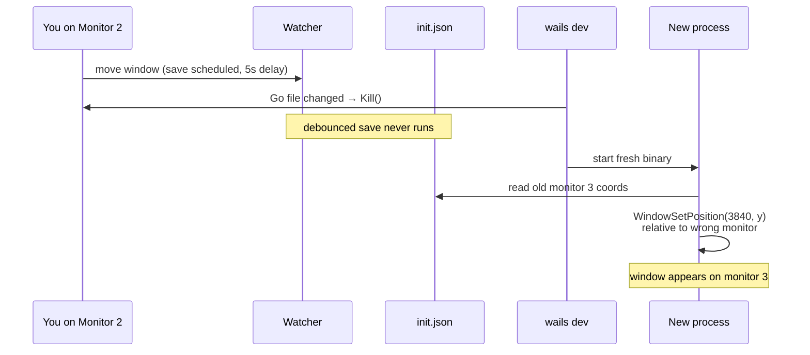

# Keyboard shortcut for error look dialog
_Exported on 6/24/2026 at 17:10:45 PDT from Cursor (3.8.23)_

---

**User**

A keyboard shortcut needs to be added to trigger the "Error Look" dialog

---

**Cursor**

I'll find how the Error Look dialog is opened and how keyboard shortcuts are defined elsewhere in the app.


Following the View menu pattern (Alt+R, Alt+H, Alt+B), I'll wire up Alt+E for the Errors lookup dialog.


Added **Alt+E** to open the Errors lookup dialog, matching the other View menu shortcuts.

**Global shortcut** in `0-global-shortcuts.tsx` — `Alt+E` sets `dialogCalculatorOpenAtom` to `true`.

**Menu hint** in `1-all-menu.tsx` — the View → Errors lookup... item now shows `Alt+E` next to it.

Press **Alt+E** from anywhere in the app to open the dialog (with the same pre-fill behavior as when opened from the menu). If you prefer a different key combo, say which one and I can change it.

---

**User**

For the web version, the window title prefix should be "TVweb" instead of "TV".

---

**Cursor**

Updating the title prefix logic so the web build uses "TVweb" instead of "TV".


The window title prefix now depends on the runtime in `3-ui-app-title.ts`:

- **Web** (no Wails backend): `TVweb - <file or folder name>`
- **Desktop** (Wails): `TV - <file or folder name>`

When no files are open, the title stays `Trace Viewer` for both versions.

---

**User**

I have three monitors. I run the test application on the second monitor, 
but whenever a change occurs in the Go part of the app, it restarts—and instead of launching on the second screen, it opens on the third.
The coordinates of the third monitor are stored in the ini file. We already have a function debounce for this, but it doesn't help much.
This only happens when go HMR is active.
What can be done about this, and why is it happening?

---

**Cursor**

Investigating how window bounds are saved, restored, and debounced during Go HMR restarts.


This is a combination of how `wails dev` restarts the Go backend and a Wails v2 multi-monitor coordinate quirk. The debounce is doing its job; it just cannot win against a hard process kill.

## Why it happens

### 1. Go HMR kills the process — it does not shut down gracefully

When you change Go code, `wails dev` rebuilds and **force-kills** the running binary (`debugBinaryProcess.Kill()`), then starts a new one. That is not the same as closing the window.

Consequences:

- **`BeforeClose` does not run** — your immediate save on exit in `app.go` never fires.
- **`OnShutdown` is not registered** in `main.go` anyway, and would not run on a kill either.
- **Any pending debounced save is discarded** — if the 5-second timer has not fired yet, nothing is written to `init.json`.

So you can sit on monitor 2 all day, but if Go rebuilds before the debounce fires, `init.json` still holds the old monitor 3 coordinates.

### 2. Wails v2 mixes two different coordinate systems on Windows

This is the deeper multi-monitor bug ([wailsapp/wails#2739](https://github.com/wailsapp/wails/issues/2739)).

On Windows, Wails internally does:

- **`WindowGetPosition`** → `GetWindowRect` → **absolute virtual-desktop coordinates** (e.g. `x=3840` on a third monitor)
- **`WindowSetPosition`** → adds your `x,y` to the **current monitor's work area origin** (coordinates relative to whichever monitor the window is on *right now*)

Your code saves with `Get` and restores with `Set`:

```121:129:c:\y\c\dp\tm-bitbucket\trace-viewer-26-go\backend\options.go
func (a *App) restoreWindowOptions(ctx context.Context) {
	opts, err := LoadIniFileOptions()
	if err == nil && opts != nil {
		if opts.Bounds != nil {
			bounds := FixBounds(opts.Bounds)
			if bounds != nil {
				runtime.WindowSetPosition(ctx, bounds.X, bounds.Y)
				runtime.WindowSetSize(ctx, bounds.Width, bounds.Height)
```

```87:88:c:\y\c\dp\tm-bitbucket\trace-viewer-26-go\backend\options.go
		x, y := runtime.WindowGetPosition(ctx)
		w, h := runtime.WindowGetSize(ctx)
```

That round-trip is only reliable when the window starts on the same monitor every time. On restart, Windows places the new hidden window on an arbitrary monitor; `SetPosition` then interprets the saved numbers relative to *that* monitor. Large saved values (monitor 3) often land on monitor 3 even though you were working on monitor 2.

### 3. What you see in practice



## Why the debounce does not help much here

The debounce is designed for normal use: avoid writing to disk on every pixel of a drag, then save ~5 seconds after movement stops. That works when the app exits cleanly via `BeforeClose`.

During Go HMR it fails because:

1. Restarts are often **more frequent than 5 seconds** while you are editing.
2. The process is **killed**, so there is no shutdown hook and no flush of the pending timer.
3. Even when a save does happen, the **Get/Set mismatch** can store coordinates that restore incorrectly on the next launch.

## What you can do

### Quick workarounds (no code)

| Approach | Effect |
|---|---|
| `wails dev -nogorebuild` | Stops Go auto-restart while you position the window |
| Delete `bounds` from `%APPDATA%\trace-viewer-26\init.json` | Stops restoring stale monitor 3 coords |
| Wait 5+ seconds after moving before triggering a Go rebuild | Sometimes works, but fragile |

### Practical code fixes (best → good)

1. **Use absolute Win32 coordinates on Windows** — Save via `GetWindowRect`, restore via `SetWindowPos` with absolute screen coords, bypassing Wails' asymmetric `SetPos`. This is the real fix for multi-monitor.

2. **Flush save on a shorter interval during dev** — e.g. save every 1–2 seconds while the window is stable, or use a 500ms debounce when `buildtype == dev`. This reduces stale `init.json` data but does not fix the coordinate bug by itself.

3. **Skip position restore in dev mode** — Detect dev (`//go:build dev` or the `buildtype` context value Wails sets) and only restore size, not position. Simplest dev UX fix.

4. **Store monitor identity** — Save absolute position plus monitor work-area origin (or index). On restore, place the window on the correct monitor first, then apply relative offset.

5. **Wire `OnShutdown`** — Helps normal exits; does **not** help Go HMR kills, but is still worth adding.

### Longer term

Wails v3 adds proper absolute-position APIs for this scenario. On v2, the maintainer suggested backporting the v3 absolute-position code if needed.

---

**Bottom line:** Go HMR prevents your position from being saved before restart, and Wails v2's Windows `Get`/`Set` asymmetry makes multi-monitor restore unreliable even when it is saved. The debounce is not the root cause — it cannot save across a hard kill, and the saved coordinates are not round-tripped correctly anyway.

If you want, I can implement a Windows-specific absolute-coordinate save/restore (the proper fix) plus a shorter dev-mode save interval so HMR restarts are less painful while you work on monitor 2.

